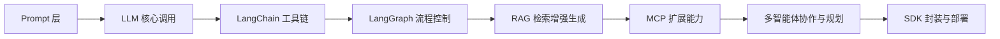

# 🤖 Agent Craft

> 智能体开发教学库 | A beginner-friendly guide to building AI agents

## 📘 项目简介

**Agent Craft** 是一个系统性开源教学项目，采用 **「博客讲解 + 代码实践」双驱动模式**，带你从零构建完整的 AI Agent 开发能力。

- 📄 **配套博客详解**：每章内容均配有 CSDN
  深度文章，涵盖原理剖析、代码解析与调试技巧
- 💻 **可运行代码仓库**：每个模块对应独立目录，含完整代码、详细注释与运行指引，支持本地复现
- 🚀 内容覆盖：从 **Prompt 工程** 到 **LangChain / LangGraph / RAG / SDK 封装**
- ⚙️ 能力进阶：涵盖 **智能体思维链、工具调用、任务规划、多智能体协作**

> 💡 本仓库目标：帮助开发者从零构建可运行的智能体应用，真正理解 Agent 的底层逻辑，而不仅仅是“调用框架”。

---

## 🧭 模块总览（16 模块）

> 💡 每个模块对应独立目录（含代码、说明与示例），可独立运行与学习。  
> 🔥 已更新至 05 LangChain 进阶篇，持续更新中！

|     章节      | 模块                                                                                                      |                                 博客                                  | 核心关键词                           |  难度  |
|:-----------:|:--------------------------------------------------------------------------------------------------------|:-------------------------------------------------------------------:|:--------------------------------|:----:|
| 🏗️ **基础篇** | [01 Agent 入门 & 环境搭建](https://github.com/Annyfee/agent-craft/tree/main/01_agent_introduction)            | [🏠](https://blog.csdn.net/2401_87328929/article/details/153729555) | OpenAI API                      |  ⭐   |
|             | [02 LLM 基础调用](https://github.com/Annyfee/agent-craft/tree/main/02_llm_fundamentals)                     | [🏠](https://blog.csdn.net/2401_87328929/article/details/153735431) | LLM API 调用 · prompt · 上下文记忆     |  ⭐   |
|             | [03 Function Calling 与工具调用](https://github.com/Annyfee/agent-craft/tree/main/03_function_calling_tools) | [🏠](https://blog.csdn.net/2401_87328929/article/details/153866573) | Function Call · 工具函数封装          |  ⭐⭐  |
| ⚙️ **框架篇**  | [04 LangChain 基础篇](https://github.com/Annyfee/agent-craft/tree/main/04_langchain_basics)                | [🏠](https://blog.csdn.net/2401_87328929/article/details/153978186) | LLM · Prompt · Chain · Memory   |  ⭐⭐  |
|             | [05 LangChain 进阶篇](https://github.com/Annyfee/agent-craft/tree/main/05_langchain_advanced)              | [🏠](https://blog.csdn.net/2401_87328929/article/details/154064397) | Agents · 多链协作 · 缓存              | ⭐⭐⭐  |
|             | 06 LangGraph 入门                                                                                         |                                🚧撰写中                                | Flow · Node · Edge 控制           | ⭐⭐⭐  |
|             | 07 RAG 基础篇（Embedding & 向量）                                                                              |                                 🚧                                  | 向量化 · 检索匹配                      |  ⭐⭐  |
|             | 08 RAG 进阶篇（检索 + 生成）                                                                                     |                                 🚧                                  | RAG Pipeline · QA 系统            | ⭐⭐⭐  |
| 🧠 **智能篇**  | 09 MCP 基础                                                                                               |                                 🚧                                  | MCP 协议 · 客户端安装                  |  ⭐⭐  |
|             | 10 MCP 进阶                                                                                               |                                 🚧                                  | 在线模型接入 · 多轮任务                   | ⭐⭐⭐  |
|             | 11 MCP 高级                                                                                               |                                 🚧                                  | 多服务组合 · 并发调用                    | ⭐⭐⭐⭐ |
|             | 12 多步骤任务规划（MCP Task Planning）                                                                           |                                 🚧                                  | Task Planning · CoT             | ⭐⭐⭐  |
|             | 13 多智能体协作                                                                                               |                                 🚧                                  | Multi-Agent · 通信机制              | ⭐⭐⭐⭐ |
|             | 14 综合案例实战                                                                                               |                                 🚧                                  | LangChain + RAG + Tool + Memory | ⭐⭐⭐⭐ |
| 🚀 **工程篇**  | 15 部署与本地化                                                                                               |                                 🚧                                  | Ollama · LM Studio · API代理      | ⭐⭐⭐  |
|             | 16 Agent SDK 封装                                                                                         |                                 🚧                                  | 模块化封装 · SDK 架构                  | ⭐⭐⭐⭐ |

---

## 🧩 当前学习建议（适用于已完成模块）

目前已开放模块：**01 ~ 04**。  
建议按顺序学习，每一章都有完整代码示例与注释。

### ✅ 模块 01 — Agent 入门 & 环境搭建

- **目标**：理解 Agent 概念，完成环境配置与首次调用。
- **内容**：环境依赖｜API Key 配置｜最小可运行 Agent

### ✅ 模块 02 — LLM 基础调用

- **目标**：掌握模型调用逻辑，初步构建智能体能力。
- **内容**：LLM了解与调用｜Prompt编写与逻辑构思｜多轮对话记忆｜独立搭建一个智能体

### ✅ 模块 03 — Function Calling 与工具调用

- **目标**：实现 LLM 调用外部函数，赋予模型“执行力”。
- **内容**：Function calling原理｜工具函数封装｜API接入实践｜多轮调用流程｜Agent能力扩展

### ✅ 模块 04 — LangChain 基础篇

- **目标**：认识Langchain六大模块，学会用Langchain构建智能体。
- **内容**：LLM 调用｜Prompt 设计｜Chain 构建｜Memory 记忆｜实战练习

### ✅ 模块 05 — LangChain 进阶篇

- **目标**：掌握Langchain Agents的核心机制，构建能调用工具、持续思考、具备记忆的智能体。
- **内容**：Function Calling｜@tool 工具封装｜ReAct 循环｜Agent 构建｜SQL Agent｜记忆+流式｜开发优化

> 📌 后续模块将陆续开放（LangGraph、RAG、MCP、多智能体等）

---

## 🧠 Agent Craft 的核心学习路径

> “让每个人都能真正理解 Agent 的底层逻辑，而不仅仅是调用框架。”

我们采用 **渐进式构建** 的教学理念，从最基础的 Prompt 开始，逐步搭建完整的 AI Agent 能力栈：



## 🚀 快速开始

### 1️⃣ 环境准备

```bash
# 克隆项目
git clone https://github.com/Annyfee/agent-craft.git
cd agent-craft

# 安装依赖
pip install -r requirements.txt
```

### 2️⃣ API Key 配置

```bash
# 复制环境变量模板
cp .env.example .env
```

在 `.env` 文件中配置：

```env
OPENAI_API_KEY=your_deepseek_api_key_here
```

> 💡 **获取API Key**: 访问 [DeepSeek官网](https://platform.deepseek.com/) 注册并获取API Key

### 3️⃣ 运行示例

```bash
python "01 Agent 入门 & 环境搭建/Agent-demo.py"
```

---

## 🤝 参与和交流

欢迎提交 **Issue / PR / 改进建议**

如果有商业/技术交流需求，请联系我:

📬 微信：a19731567148（备注 GitHub）

📖 个人博客：[CSDN 主页](https://blog.csdn.net/2401_87328929)

