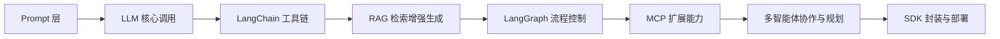

# 🤖 Agent Craft —— 从零构建全栈AI智能体

> ✅ **系统性开源教学项目**，手把手带你用 Python 构建可运行的 AI Agent，涵盖 Prompt、LLM、LangChain、RAG、LangGraph、MCP 到部署发布全流程。

[](https://github.com/Annyfee/agent-craft/actions/workflows/ci.yml)

## 📘 项目简介

如果你正在学习 AI 智能体开发，却卡在“知道概念但不会动手”或“会调 API 但不懂原理”的阶段——  
**Agent Craft 就是为你设计的学习路径。**

我们从最基础的 LLM 调用开始，一步步带你构建完整的 Agent 能力栈：  
- 让模型调用外部工具（Function Calling）  
- 接入私有知识库实现问答（RAG）  
- 用 LangGraph 实现带状态、可调试的决策流程  
- 整合记忆、工具与检索，打造真正可用的智能体  

所有内容围绕两个原则展开：  
- 💻 **代码可运行**：每个模块独立、注释清晰、本地一键复现  
- 📖 **原理可理解**：配套 CSDN 博客详解设计思路与关键机制  

> 💡 **我们不重复造轮子，但也不止于调用框架**——  
> 而是在 LangChain、LangGraph 等主流工具中，看清 Agent 是如何思考、决策与行动的。


---

## 🧭 模块总览（15 模块）

> 💡 每个模块对应独立目录（含代码、说明与示例），可独立运行与学习。  
> 🔥 已更新至 13 Streamlit 快速入门，持续更新中！

|     章节      | 模块                                                                                                       |                                  博客                                  | 核心关键词                                                        |  难度   |
|:-----------:|:---------------------------------------------------------------------------------------------------------|:--------------------------------------------------------------------:|:-------------------------------------------------------------|:-----:|
| 🏗️ **基础篇** | [01 Agent 入门 & 环境搭建](https://github.com/Annyfee/agent-craft/tree/main/m01_agent_introduction)            | [🏠](https://blog.csdn.net/2401_87328929/article/details/153729555)  | OpenAI API                                                   |   ⭐   |
|             | [02 LLM 基础调用](https://github.com/Annyfee/agent-craft/tree/main/m02_llm_fundamentals)                     | [🏠](https://blog.csdn.net/2401_87328929/article/details/153735431)  | LLM API 调用 · prompt · 上下文记忆                                  |   ⭐   |
|             | [03 Function Calling 与工具调用](https://github.com/Annyfee/agent-craft/tree/main/m03_function_calling_tools) | [🏠](https://blog.csdn.net/2401_87328929/article/details/153866573)  | Function Call · 工具函数封装                                       |  ⭐⭐   |
| ⚙️ **框架篇**  | [04 LangChain 基础篇](https://github.com/Annyfee/agent-craft/tree/main/m04_langchain_basics)                | [🏠](https://blog.csdn.net/2401_87328929/article/details/153978186)  | LLM · Prompt · Chain · Memory                                |  ⭐⭐   |
|             | [05 LangChain 进阶篇](https://github.com/Annyfee/agent-craft/tree/main/m05_langchain_advanced)              | [🏠](https://blog.csdn.net/2401_87328929/article/details/154064397)  | Agents · 缓存 · 流式输出                                           |  ⭐⭐⭐  |
|             | [06 RAG 基础篇](https://github.com/Annyfee/agent-craft/tree/main/m06_rag_basics)                            | [🏠](https://blog.csdn.net/2401_87328929/article/details/154230067)  | RAG概念 · Split · Embedding · FAISS · RAG 链                    |  ⭐⭐   |
|             | [07 RAG 进阶篇](https://github.com/Annyfee/agent-craft/tree/main/m07_rag_advanced)                          | [🏠](https://blog.csdn.net/2401_87328929/article/details/154408744)  | Chroma · Reranker · RAG工具化 · 集成                              |  ⭐⭐⭐  |
|             | [08 LangGraph 基础篇](https://github.com/Annyfee/agent-craft/tree/main/m08_langgraph_basics)                | [🏠](https://blog.csdn.net/2401_87328929/article/details/154576812)  | Langgraph三要素 · LangSmith · ReAct · 提示词安全注入                   |  ⭐⭐⭐  |
|             | [09 LangGraph 进阶篇](https://github.com/Annyfee/agent-craft/tree/main/m09_langgraph_advanced)              | [🏠](https://blog.csdn.net/2401_87328929/article/details/154803618)  | Human-in-the-Loop · Graph-as-a-Tool · Multi-Agent 多智能体编排     | ⭐⭐⭐⭐  |
| 🧠 **智能篇**  | [10 MCP 基础 (Server)](https://github.com/Annyfee/agent-craft/tree/main/m10_mcp_basics)                    | [🏠](https://blog.csdn.net/2401_87328929/article/details/155660129)  | Stdio · Streamable HTTP · FastMCP框架 · Transport通信 · 构建私有 MCP |  ⭐⭐   |
|             | [11 MCP 进阶 (Client)](https://github.com/Annyfee/agent-craft/tree/main/m11_mcp_advanced)                  | [🏠](https://blog.csdn.net/2401_87328929/article/details/155316396)  | langchain-mcp-adapters框架 · 流式输出 · AsyncExitStack · 连接公共MCP   |  ⭐⭐⭐  |
|             | [12 Agents SDK & Swarm 模式](https://github.com/Annyfee/agent-craft/tree/main/m12_agents_sdk_swarm)        | [🏠](https://blog.csdn.net/2401_87328929/article/details/155890608)  | Swarm · Handoff · Agents SDK · 去中心化 ·“航空公司客服”项目              | ⭐⭐⭐⭐  |
| 🏁 **实战篇**  | [13 Streamlit 快速入门](https://github.com/Annyfee/agent-craft/tree/main/m13_streamlit)                       | [🏠](https://blog.csdn.net/2401_87328929/article/details/156131372) | Streamlit · st.chat_message · 异步事件流 · 会话持久化 · “智能客服驾驶舱”      |  ⭐⭐⭐  |
|             | 14 综合实战项目                                                                                                |                                🚧撰写中                                 | LangGraph + RAG + MCP + Streamlit + Vercel                   | ⭐⭐⭐⭐⭐ |
| 🚀 **工程篇**  | 15 部署上线与项目总结                                                                                             |                                  🚧                                  | `Ollama` · `LM Studio` · `LangServe`                         |  ⭐⭐⭐  |

---

## 🧩 各模块详细学习建议

目前已开放模块：**01 ~ 13**。  
建议按顺序学习，每一章都有完整代码示例与注释。

<details>

<summary>💡 点击展开 / 收起各模块学习目标与内容详情</summary>

### ✅ 模块 01 — Agent 入门 & 环境搭建

- **目标**：理解 Agent 概念，完成环境配置与首次调用。
- **内容**：环境依赖｜API Key 配置｜最小可运行 Agent

### ✅ 模块 02 — LLM 基础调用

- **目标**：掌握模型调用逻辑，初步构建智能体能力。
- **内容**：LLM了解与调用｜Prompt编写与逻辑构思｜多轮对话记忆｜独立搭建一个智能体

### ✅ 模块 03 — Function Calling 与工具调用

- **目标**：实现 LLM 调用外部函数，赋予模型“执行力”。
- **内容**：Function calling原理｜工具函数封装｜API接入实践｜多轮调用流程｜Agent能力扩展

### ✅ 模块 04 — LangChain 基础篇

- **目标**：认识Langchain六大模块，学会用Langchain构建智能体。
- **内容**：LLM 调用｜Prompt 设计｜Chain 构建｜Memory 记忆｜实战练习

### ✅ 模块 05 — LangChain 进阶篇

- **目标**：掌握Langchain Agents的核心机制，构建能调用工具、持续思考、具备记忆的智能体。
- **内容**：Function Calling｜@tool 工具封装｜ReAct 循环｜Agent 构建｜SQL Agent｜记忆+流式｜开发优化

### ✅ 模块 06 — Rag 基础篇

- **目标**：理解Rag的概念与整个运行流程，并能够搭建一个可以引用外部知识库获取信息的智能体。
- **内容**：RAG 概念｜文本加载与分块 (Load & Split)｜向量化 (Embedding)｜向量存储 (FAISS)｜LCEL RAG 链

### ✅ 模块 07 — Rag 进阶篇

- **目标**：学会进阶的Chroma向量数据库，会Reranker精排序，最终将04到07所学的Langchain六大模块完整集成。
- **内容**：Chroma 持久化 | Reranker 精排 | RAG 工具化 | Langchain六大模块集成

### ✅ 模块 08 — LangGraph 基础篇

- **目标**：懂得Langgraph的三要素，会使用LangSmith调试当前agent，并能自己写一个简单的Langgraph流程。
- **内容**：Langgraph核心三要素｜ReAct循环白盒化实现 | LangSmith调试追踪 | 持久化记忆 | 提示词安全注入

### ✅ 模块 09 — LangGraph 进阶篇

- **目标**：学会人工审批机制的添加，子图工具化的封装与多智能体流程编排。最终可以融合这三个知识点做一个复杂Agent出来。
- **内容**：Human-in-the-Loop（人工干预）｜ Graph-as-a-Tool（图即工具）| Multi-Agent 多智能体编排

### ✅ 模块 10 — MCP 基础篇

- **目标**：能够借助FastMCP框架，编写支持Stdio与Streamable HTTP两种通信协议的MCP服务器。
- **内容**：Stdio | Streamable HTTP | FastMCP框架 | Transport通信 | 构建私有 MCP

### ✅ 模块 11 — MCP 进阶篇

- **目标**：会使用langchain-mcp-adapters框架，搭建一个支持Stdio与Streamable双模通信的MCP客户端，最终可在控制台流式打印。
- **内容**：langchain-mcp-adapters框架 | 流式输出 | AsyncExitStack | 连接公共MCP 

### ✅ 模块 12 — Agents SDK & Swarm 模式

- **目标**：理解Swarm模式，并能用Agents SDK做一个多Agent协调互通的客服集群。
- **内容**：Swarm | Handoff | Context_variables | Agents SDK | 去中心化

### ✅ 模块 13 Streamlit 快速入门

- **目标**：学会Streamlit的基础组件，并能用Streamlit对接Agents SDK，快速构建起一个前后端联通的实际产品。
- **内容**：Swarm | Handoff | Context_variables | Agents SDK | 去中心化

> 📌 后续模块将陆续开放（综合实战等）

</details>

---

## 🧠 Agent Craft 的核心学习路径

> “让每个人都能真正理解 Agent 的底层逻辑，而不仅仅是调用框架。”

我们采用 **渐进式构建** 的教学理念，从最基础的 Prompt 开始，逐步搭建完整的 AI Agent 能力栈：



## 🚀 快速开始

### 1️⃣ 环境准备

> 💡 **环境要求**: Python 3.10–3.12，Node.js v20+


```bash
# 1. 克隆项目
git clone https://github.com/Annyfee/agent-craft.git
cd agent-craft

# 2. 安装依赖
pip install -r requirements.txt

# 3. 以开发者模式安装项目（重要!）
pip install -e .
```

### 2️⃣ API Key 配置

```bash
# 复制环境变量模板
cp .env.example .env
```

在 `.env` 文件中配置：

```env
OPENAI_API_KEY=your_deepseek_api_key_here
LANGCHAIN_API_KEY=your_langsmith_api_key
AMAP_MAPS_API_KEY=your_gaode_api_key
CHATGPT_API_KEY=your_chatgpt_api_key
```

> 💡 **获取API Key**: 访问 [DeepSeek](https://platform.deepseek.com/)、[LangSmith](https://smith.langchain.com/)、[高德地图](https://console.amap.com/dev/key/app)、[ChatGPT](https://platform.openai.com/api-keys)
> 注册并获取API Key
> 
> 📌 **补充说明**: 除了 OPENAI_API_KEY (LLM 的 API Key) 是刚需外，其他 API Key 按需填入，无需一次性全部配置。

### 3️⃣ 运行示例

一切就绪！运行第一个 Agent 示例：

```bash
python "m01_agent_introduction/Agent-demo.py"
```


---
## 🤝 参与与交流

- 📬 提交 Issue / PR：欢迎提出改进建议或贡献代码！
- 📩 技术交流：微信 a19731567148（备注 Agent）
- 📚 博客主页：[CSDN 主页](https://blog.csdn.net/2401_87328929)

🌟 如果这个项目帮到了你，请给我点个 Star ⭐，这将是我持续更新的最大动力！


